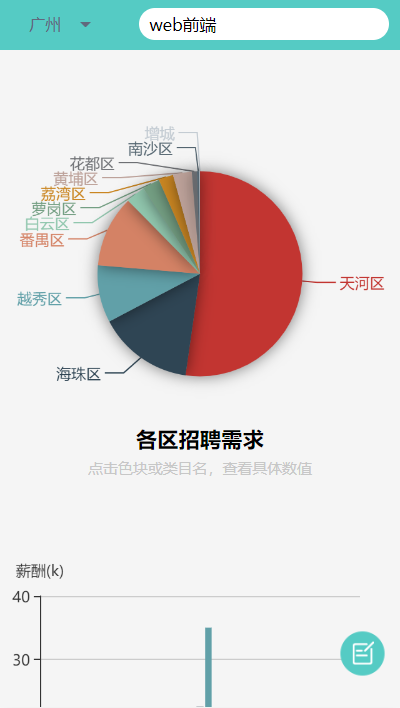
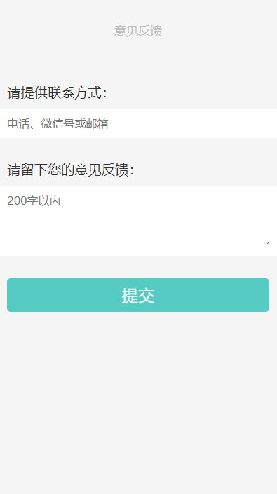

# About
此项目是vue2.0 + minu-ui + echarts的数据图表展示项目，关于这个项目的详细说明可以移步到我的博客文章【Vue+Flask】前端到后端通关之路（1）

## 项目运行
```
npm install
npm run dev

npm run test (打包到测试环境)
npm run build (打包到生产环境)
```

## 部分截图
</br></br></br>


## 效果预览
